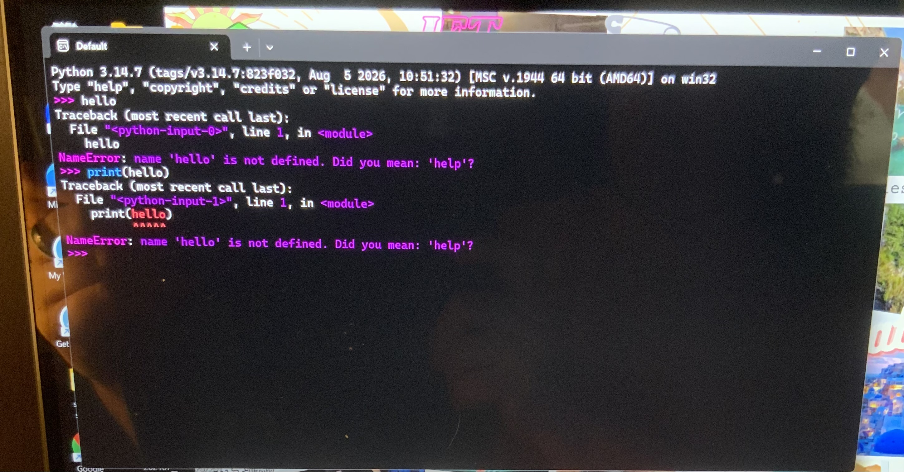

# -Assignments
Enrolled course assignments
# # Lab 1: Introduction to Python

## Question 1

## Programming Language Table

| Number of Languages | Type of Language |
|--------------------:|------------------|
| 5 | Compiled |
| 4 | Interpreted |
| 2 | Both |

## Question 2

## Python Performance

[A real-world example where Python can offer superior performance is in scientific computing and data analysis using the NumPy library. NumPy allows Python to process large amounts of numerical data using vectorized operations. Instead of writing individual loops to process every value, NumPy can perform calculations on an entire array at once. These operations are executed behind the scenes using optimized, precompiled code, allowing them to run at speeds close to C or C++. Python also allows programmers to accomplish these tasks with fewer lines of code, making development faster and easier. For applications such as data analysis, machine learning, image processing, and scientific calculations, this combination of speed and programming efficiency makes Python very effective.]

## Question 3

Screenshot showing that Python 3 is installed successfully:

## Question 4

Screenshot showing the Github repository is all set up for this course:

